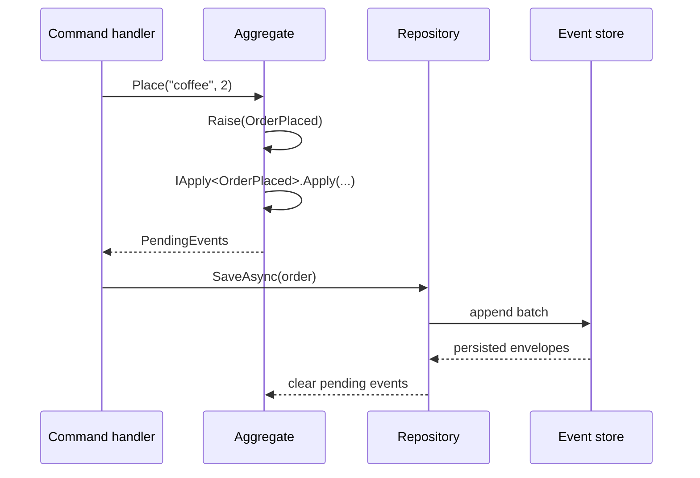

An aggregate is a small consistency boundary. Its public methods decide whether
a business action is valid; its events record that an accepted action happened.
EventLoom uses the same event application code both immediately and during
rehydration.



## An event is a persisted contract

Use an immutable type, a stable event name, a positive schema version, and an
explicit aggregate owner:

```csharp
public sealed record OrderPlaced(string Sku, int Quantity)
    : IDomainEvent<OrderPlaced, Order>
{
    public static string EventType => "orders.order-placed";
    // public static int EventVersion => 2; // optional, defaults to 1
}
```

The CLR type name is not part of the stored identity. You may rename
`OrderPlaced` later without rewriting data when the stable event name and its
serialized shape stay compatible. Never rename `EventType` after events have
been stored.

Keep stream ID, tenant ID, event ID, versions, timestamps, and technical
transport data out of the payload. Those are immutable envelope fields supplied
by EventLoom.

## An aggregate applies its own events

```csharp
public sealed class Order(Guid id) : Aggregate<Order, Guid>(id),
    IApply<OrderPlaced>
{
    public string Status { get; private set; } = "draft";

    public void Place(string sku, int quantity)
    {
        if (Status != "draft" || quantity <= 0)
        {
            throw new InvalidOperationException("Only a draft order can be placed.");
        }

        Raise(new OrderPlaced(sku, quantity));
    }

    void IApply<OrderPlaced>.Apply(OrderPlaced @event) => Status = "placed";
}
```

`Raise` immediately applies the event, increments the aggregate version, and
adds it to `PendingEvents`. `ApplyHistory` replays stored events without adding
them to `PendingEvents`. Implement `IApply<TEvent>` explicitly so handlers stay
off the aggregate's public surface and are called only by EventLoom.

Use `Aggregate<TSelf, TId>` with the concrete aggregate as `TSelf`. Abstract
aggregate bases must also be generic, for example
`abstract class AuditedAggregate<TSelf>(Guid id) : Aggregate<TSelf, Guid>(id)
where TSelf : AuditedAggregate<TSelf>`. Events are owned by concrete
aggregates; base-owned events are not supported.

## What is checked

The compiler enforces the core wiring:

- `IDomainEvent<TSelf, TAggregate>` requires `TAggregate : Aggregate, IApply<TSelf>`;
- missing `EventType` implementations fail to compile;
- `Raise<TEvent>` accepts only events owned by the current aggregate;
- snapshot contracts require the aggregate to implement `ISnapshotable<TSnapshot>`.

The analyzer bundled inside the `EventLoom` package adds deterministic and
safety checks: correct `Aggregate<TSelf, TId>` usage, no `Raise` inside
constructors, handlers, or snapshot callbacks, no direct calls to handler or
snapshot members, deterministic handlers, constant non-empty names and positive
versions, duplicate names in a compilation, and immutable event/snapshot DTOs.

Runtime guards back these rules up for dynamic paths: invalid self types throw
`InvalidAggregateTypeException`, nested raises throw `NestedRaiseException`,
replaying an event owned by another aggregate throws `EventOwnershipException`,
aggregate factories that return null are rejected with `InvalidOperationException`,
and factories that return already-mutated aggregates are rejected with
`AggregateFactoryException`.

## Persist aggregates through a configured repository

Configure the aggregate's durable identity once:

```csharp
eventLoom.AddAggregate<Order, Guid>(aggregate => aggregate
    .ConstructWith(id => new Order(id))
    .UseStream("order", id => id.ToString("D")));
```

`AddAggregate<TAggregate, TId>` automatically registers every event owned by
that aggregate through its `IApply<TEvent>` interfaces. Both the aggregate type
string and stream-ID conversion are persisted contracts. Keep them stable after
writing data. The configured repository then loads by ID, replays the stream,
derives optimistic concurrency expectations, and saves the events raised by
normal domain methods.

Use `EventStore` directly only when background, import, repair, or integration
code must provide an explicit stream identity. If no repository is needed, call
`AddAggregateEvents<TAggregate>()` to register the aggregate's owned events.
See [Append and read events](/guides/append-and-read).
