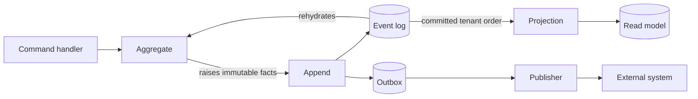

EventLoom keeps the domain model independent from EF Core, a database provider,
and message transports. The application owns business behavior; EventLoom owns
the mechanics of storing and processing the facts that behavior produces.

## The boundaries that matter

### Domain boundary

Your code defines aggregates, domain events, validation, and the public methods
that execute business decisions. An aggregate changes state only by applying an
event. This makes the command path and replay path use the same state
transition.

Event payloads contain business facts. EventLoom stores infrastructure data
such as the tenant, stream, versions, event ID, occurrence time, and
correlation metadata in the envelope.

### Event-store boundary

`EventStoreDbContext` is a dedicated EF Core context. Keep it separate from an
application context even when both use the same database. That separation keeps
migrations, indexes, query behavior, transaction ownership, and operational
tuning explicit.

An append commits a batch of events atomically. It validates the requested
stream state, assigns consecutive stream versions and tenant offsets, writes
the batch, and either commits all changes or rolls them back.

### Processing boundary

Projections and the outbox consume **committed** events. They never run as part
of normal aggregate command handling unless you explicitly register an inline
projection. This prevents a read model or external system from observing an
event that never commits.

Read [Delivery model](/concepts/delivery-model) before choosing a projection
type or calling an external service. It explains which operations are atomic
and which are at least once.

## Provider boundary

EventLoom presents the same normal append/read API to both providers, but their
operational guarantees differ.

| Concern | SQLite | PostgreSQL |
| --- | --- | --- |
| Intended topology | Local, embedded, test, or one controlled process | Production services and multiple application instances |
| Schemas | Not supported | Supported |
| Distributed worker leases | Not supported | Supported and fenced |
| Safe multi-instance worker processing | No | Yes |
| Recommended use | Development and controlled single-node applications | Distributed production deployments |

SQLite is not a lower-cost way to test PostgreSQL concurrency or worker
behavior. Use PostgreSQL whenever two independent processes can append, project,
or publish against the same event store.

## Coordinating application data

By default, application data and an event append use independent transactions.
This is the simplest and safest choice. When both must commit together in one
relational database, configure both contexts with the **same scoped
`DbConnection`** and use `EventStore.BeginUnitOfWorkAsync` or an existing
transaction with `AppendInTransactionAsync`.

That is an explicit advanced integration boundary, not a distributed
transaction. It cannot coordinate separate databases or an external broker;
use the transactional outbox for those cases.
