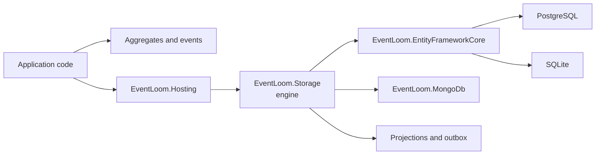

EventLoom keeps the domain model independent from persistence technology and
message transports. Application code talks to the provider-neutral engine in
`EventLoom.Storage`; storage providers implement the SPI behind it.

```mermaid
flowchart LR
    App[Application code] --> Domain[Aggregates and events]
    App --> Hosting[EventLoom.Hosting]
    Hosting --> Engine[EventLoom.Storage<br/>engine]
    Engine --> Ef[EventLoom.EntityFrameworkCore]
    Ef --> Postgres[PostgreSQL]
    Ef --> Sqlite[SQLite]
    Engine --> Mongo[EventLoom.MongoDb]
    Engine --> Workers[Projections and outbox]
```

## The boundaries that matter

### Domain boundary

Your code defines aggregates, domain events, validation, and the public methods
that execute business decisions. An aggregate changes state only by applying an
event. This makes the command path and replay path use the same state
transition.

Event payloads contain business facts. EventLoom stores infrastructure data
such as the tenant, stream, versions, event ID, occurrence time, and
correlation metadata in the envelope.

### Engine boundary

`EventLoom.Storage` contains the provider-neutral APIs application code uses:
`EventStore`, `AggregateRepository<TAggregate, TId>`, snapshots, projection and
outbox administration, and `EventLoomUnitOfWork`.

An append commits a batch of events atomically. It validates the requested
stream state, assigns consecutive stream versions and tenant offsets, writes the
batch, optionally writes outbox messages, and either commits all changes or
rolls them back.

### Provider boundary

Storage providers implement `IEventStorage`, `ISnapshotStorage`,
`IProjectionStorage`, `IOutboxStorage`, `IWorkerLeaseStorage`, and
`IStorageSchema`. Every provider must make appends atomic, enforce optimistic
concurrency per stream, assign gapless tenant offsets that become visible in
commit order, scope every operation to a tenant, and use monotonically
increasing fencing tokens for worker leases.

Built-in providers differ in implementation strategy and topology support. See
[Storage providers](/concepts/storage-providers) for the full capability matrix
and trade-offs.

### Processing boundary

Projections and the outbox consume **committed** events. They never run as part
of normal aggregate command handling unless you explicitly register an inline
projection. This prevents a read model or external system from observing an
event that never commits.

Read [Delivery model](/concepts/delivery-model) before choosing a projection
type or calling an external service. It explains which operations are atomic
and which effects can repeat.

## Coordinating application data

By default, application data and an event append use independent transactions.
This is the simplest and safest choice.

When both must commit together, coordination is provider-specific:

- **EF Core providers** share one relational transaction through
  `EventStore.BeginUnitOfWorkAsync()` and `unitOfWork.EnlistAsync(dbContext)`.
  Both contexts must use the exact same scoped `DbConnection` instance.
- **MongoDB** shares one `IClientSessionHandle` through
  `EventStore.BeginUnitOfWorkAsync()` and `unitOfWork.Session`, so additional
  MongoDB writes can participate in the same transaction.

That is an explicit advanced integration boundary, not a distributed
transaction. It cannot coordinate separate databases or an external broker; use
the transactional outbox for those cases.
