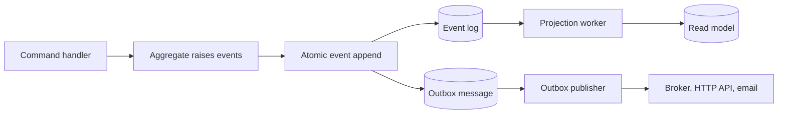

EventLoom makes different guarantees at different boundaries. The key design
question is not "is this exactly once?" but "which state changes share a
transaction, and which effects can be repeated?"

## What commits together

An append is atomic: EventLoom writes the event batch, stream versions, and
tenant offsets together. When an outbox publisher is configured, it also writes
one outbox message per event in that same append transaction. Either all of
that state commits or none of it does.

A transactional EF projection is also atomic at its own boundary: its read
model changes and checkpoint advance commit in one transaction. If its handler
fails, neither commits. This produces effectively-once *database effects* for
that projection, as long as the read model is mapped in the EventLoom context.

## What can repeat

Asynchronous projections and outbox publishers are at-least-once. A process can
complete a handler or external publication and stop before recording its
checkpoint or delivery result. On recovery, EventLoom can deliver the same
event or message again.

Make effects outside the transactional EF projection boundary idempotent:

- use `OutboxMessage.MessageId` as the destination's deduplication key;
- make asynchronous projection handlers safe to run more than once;
- store downstream idempotency state with the effect it protects.

EventLoom intentionally does not claim general exactly-once delivery to an
external broker, HTTP service, or email provider.

## Choose the right processing mode

| Need | Use | Important constraint |
| --- | --- | --- |
| Reject an append when related database work fails | Inline projection | Perform transactional database work only; no external effects. |
| Maintain an EventLoom-context read model with its checkpoint | Transactional EF projection | Do not call `SaveChangesAsync` from the handler. |
| Call an external service or use another application context | Asynchronous projection | The handler must be idempotent. |
| Publish every persisted event to an external destination | Transactional outbox | The publisher must deduplicate by stable message ID. |

The [Projections](/guides/projections) and [Outbox and application
integration](/guides/outbox) guides show the registration, failure recovery,
and operational procedures for each mode.
