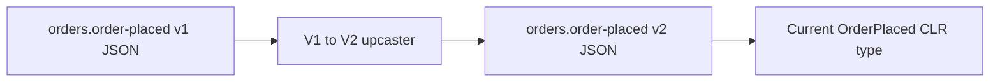

Once an event is stored, its name, version, and JSON shape become durable
application data. EventLoom locates an event by its stable `[EventType]` name
and schema version, never by its CLR type name.



## What can change safely

| Change | Safe without data migration? | Requirement |
| --- | --- | --- |
| Rename a CLR event type or move its namespace | Yes | Keep the stable event name and compatible JSON contract. |
| Add a new event type | Yes | Register a new unique event name. |
| Change an event payload shape | Not directly | Increase the event version and register a complete upcaster chain. |
| Change JSON naming, converters, reference handling, or number handling | Usually no | Treat the serializer setting as a stored-data compatibility change. |
| Remove a historical event type | Yes | Keep one current type and upcast historical JSON to it. |

## Default JSON serialization

EventLoom uses camel-case property names, strict number handling, and
case-sensitive property names by default. Explicitly register every persisted
event:

```csharp
eventLoom
    .AddEvent<OrderPlaced>()
    .AddEvent<OrderCancelled>();
```

Use `ConfigureEventSerialization(...)` to add converters or change these
defaults. Treat each setting as a persisted-data compatibility decision.

## Evolve payloads one version at a time

Increase `EventType.Version` for a payload change. An `IEventUpcaster` receives
JSON and transforms exactly one version to the next:

```csharp
public sealed class OrderPlacedV1ToV2 : IEventUpcaster
{
    public string EventName => "orders.order-placed";
    public int FromVersion => 1;
    public int ToVersion => 2;

    public JsonElement Upcast(JsonElement payload)
    {
        var values = JsonSerializer.Deserialize<Dictionary<string, JsonElement>>(
            payload.GetRawText())
            ?? throw new InvalidOperationException("The v1 payload was empty.");

        values["currency"] = JsonSerializer.SerializeToElement("EUR");
        return JsonSerializer.SerializeToElement(values);
    }
}
```

Upcasters must be deterministic, side-effect-free, and complete from every
stored version to the current version. Do not read a database, clock, network,
or runtime configuration while upcasting. EventLoom rejects incomplete,
ambiguous, and non-sequential chains.

Snapshots use the same principle but are only a replay cache: an unusable
snapshot can fall back to event replay. An unreadable event payload cannot be
silently skipped, because it is part of authoritative history.
