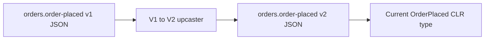

Once an event is stored, its name, version, and JSON shape become durable
application data. EventLoom locates an event by its stable `EventType` name and
schema version, never by its CLR type name.


```mermaid
flowchart LR
    V1[orders.order-placed v1 JSON] --> Upcaster[V1 to V2 upcaster]
    Upcaster --> V2[orders.order-placed v2 JSON]
    V2 --> Current[Current OrderPlaced CLR type]
```

## What can change safely

| Change | Safe without data migration? | Requirement |
| --- | --- | --- |
| Rename a CLR event type or move its namespace | Yes | Keep the stable event name and compatible JSON contract. |
| Add a new event type | Yes | Give it a new unique event name and handle it on its owning aggregate. |
| Change an event payload shape | Not directly | Increase `EventVersion` and register a complete upcaster chain. |
| Change JSON naming, converters, reference handling, or number handling | Usually no | Treat the serializer setting as a stored-data compatibility change. |
| Remove a historical event CLR type | Yes | Keep one current CLR type for the event name and upcast historical JSON to it. |

## Default JSON serialization

EventLoom uses camel-case property names, strict number handling, and
case-sensitive property names by default. Aggregate registration registers the
current CLR event types owned by that aggregate:

```csharp
eventLoom.AddAggregate<Order, Guid>(aggregate => aggregate
    .ConstructWith(id => new Order(id))
    .UseStream("order", id => id.ToString("D")));
```

When using `EventStore` without an aggregate repository, call
`AddAggregateEvents<Order>()` to register the events owned by `Order`.

Use `ConfigureEventSerialization(...)` to add converters or change these
defaults. Treat each setting as a persisted-data compatibility decision.

## Evolve payloads one version at a time

Only the current CLR type exists for each event name. Bump `EventVersion` for a
payload change, update that current record type, and add an `IEventUpcaster`
that transforms stored JSON exactly one version to the next:

```csharp
public sealed record OrderPlaced(string Sku, int Quantity, string Currency)
    : IDomainEvent<OrderPlaced, Order>
{
    public static string EventType => "orders.order-placed";
    public static int EventVersion => 2;
}

public sealed class OrderPlacedV1ToV2 : IEventUpcaster
{
    public string EventName => "orders.order-placed";
    public int FromVersion => 1;
    public int ToVersion => 2;

    public JsonElement Upcast(JsonElement payload)
    {
        var values = JsonSerializer.Deserialize<Dictionary<string, JsonElement>>(
            payload.GetRawText())
            ?? throw new InvalidOperationException("The v1 payload was empty.");

        values["currency"] = JsonSerializer.SerializeToElement("EUR");
        return JsonSerializer.SerializeToElement(values);
    }
}
```

Upcasters must be deterministic, side-effect-free, and complete from every
stored version to the current version. Do not read a database, clock, network,
or runtime configuration while upcasting. EventLoom rejects incomplete,
ambiguous, and non-sequential chains. A stored version newer than the
registered current type throws `EventNotRegisteredException`; a missing older
version chain throws `EventUpcastChainException`.

Never rename stable `EventType` strings or decrease versions. A committed
contract baseline file to catch accidental renames and version decreases is a
planned follow-up and is not yet available.

Snapshots use the same principle with `SnapshotVersion` and
`ISnapshotUpcaster`, but are only a replay cache: an unusable snapshot can fall
back to event replay. An unreadable event payload cannot be silently skipped,
because it is part of authoritative history.
