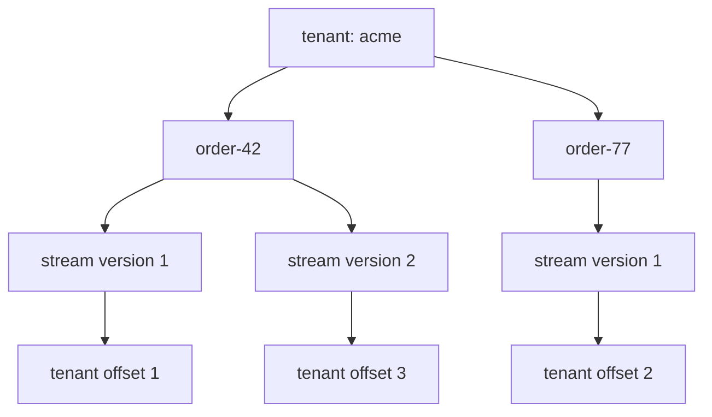

Every EventLoom event belongs to one stream and one tenant. These scopes solve
different problems: stream versions protect an aggregate decision, while tenant
offsets provide the committed order consumed by projections and background
readers.



## Tenant scope

Single tenancy is the default. EventLoom uses the stable persisted tenant ID
`default`, so ordinary repository calls need no tenant plumbing.

Use multi-tenancy only when the application can resolve a trusted, scoped
tenant:

```csharp
services.AddEventLoom(eventLoom => eventLoom
    .UseMultiTenancy<AuthenticatedTenantAccessor>()
    .UsePostgreSql(connectionString)
    .AddEvent<OrderPlaced>());
```

In multi-tenant mode, EventLoom rejects missing scoped tenants and explicit
tenant IDs that disagree with the accessor. It cannot authenticate a tenant for
you: resolve it from a trusted authentication, authorization, or routing
boundary, not an unvalidated client header.

## Optimistic concurrency

An append states the stream condition it expects:

| Expectation | Use when |
| --- | --- |
| `ExpectedVersion.NoStream` | Creating a stream that must not already exist. |
| `ExpectedVersion.Exact(version)` | Updating a stream after reading a known version. |
| `ExpectedVersion.StreamExists` | Appending when any existing stream version is acceptable. |
| `ExpectedVersion.Any` | Performing an explicit low-level append without an application-level check. |

Configured aggregate repositories derive the exact expected version from the
aggregate they loaded. A visible `WrongExpectedVersionException` or
`EventStoreConcurrencyException` means another writer changed the stream.
Reload the aggregate, reassess the business decision, and retry only if that
decision still makes sense.

## Retry identity is not concurrency

`AppendId` identifies one caller-owned command within a tenant. Preserve the
same value only when retrying after an ambiguous outcome such as a timeout:

```csharp
await repository.SaveAsync(order, appendId: commandId);
```

If the original append committed, retrying with the same append ID returns the
original envelopes with `WasIdempotentReplay` set. Generating a new append ID
for every retry creates a second command; reusing one for different commands is
invalid.

## Read the right order

- **Stream version** orders facts in one aggregate stream. Use it for replay
  and optimistic concurrency.
- **Tenant offset** orders committed facts across all streams in one tenant.
  Use it for projections and tenant-log readers.
- **Event ID** is a stable UUIDv7 identity for a specific event. It is not the
  authoritative ordering mechanism.

Never compare tenant offsets across tenants. A checkpoint is always scoped to
one tenant and one projection version.
