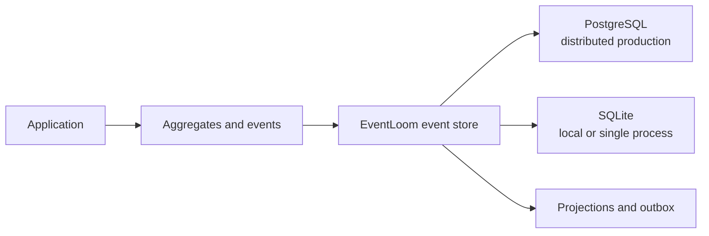

EventLoom is an opinionated event-sourcing library for .NET 10 and EF Core 10.
It gives .NET applications an explicit event model, a dedicated relational
event store, aggregate repositories, snapshots, projections, and a
transactional outbox.

## Choose your next step

| I want to... | Start here |
| --- | --- |
| Evaluate EventLoom from this repository | [Installation](/getting-started/installation) |
| Learn the event-sourcing programming model | [Build your first aggregate](/getting-started/first-aggregate) |
| Decide where and how to persist events | [Architecture](/concepts/architecture) |
| Understand correctness and delivery guarantees | [Tenancy and ordering](/concepts/tenancy-and-ordering) and [Delivery model](/concepts/delivery-model) |
| Add EventLoom to an application | [Configure the event store](/guides/configure-ef-core) |
| Build read models or external integration | [Projections](/guides/projections) and [Outbox and application integration](/guides/outbox) |
| Run EventLoom in production | [Production deployment](/guides/production-deployment) |

## The developer model

1. Model business facts as immutable, versioned events.
2. Change aggregate state only by applying those events.
3. Append an event batch atomically with an expected stream version.
4. Build read models and external integration from the committed event log.

The [Aggregates and events](/concepts/aggregates-and-events) concept explains
why these boundaries matter. The [Ordering API sample](/guides/ordering-api)
shows the complete application path in an ASP.NET Core service.

## What EventLoom provides

- `Aggregate<TId>` for event-only state changes and replay through typed
  `Apply(TEvent)` methods.
- Stable event names and versions through `[EventType]`, explicit registration,
  and JSON serialization.
- Deterministic JSON upcaster chains for changing persisted event schemas.
- Transactional append and bounded read APIs with expected-version checks,
  UUIDv7 event IDs, and authoritative per-tenant offsets.
- A PostgreSQL provider for multi-instance deployments and a SQLite provider
  for local, embedded, and controlled single-node use.
- Optional required tenancy with a scoped `ITenantAccessor`.
- A configured `AggregateRepository<TAggregate, TId>` path that keeps tenant,
  aggregate type, and stream-ID plumbing out of normal command handlers.
- Checkpointed asynchronous projections, atomic EF projection handlers, and
  explicitly registered inline projections.

## Current status

EventLoom is pre-release software and its NuGet packages are not published
yet. Use this repository to evaluate it; package names in examples describe
the planned public distribution surface. Check the
[packages and compatibility reference](/reference/packages) and
[configuration reference](/reference/configuration) before relying on a
feature that affects persisted data or operational behavior.
