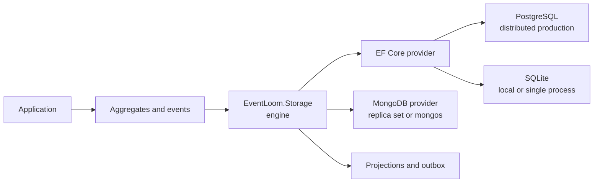

EventLoom is an opinionated event-sourcing framework for .NET 10. It gives
applications explicit aggregates and events, a provider-neutral storage engine,
and built-in providers for PostgreSQL, SQLite, and MongoDB.

```mermaid
flowchart LR
    App[Application] --> Domain[Aggregates and events]
    Domain --> Engine[EventLoom.Storage<br/>engine]
    Engine --> Ef[EF Core provider]
    Ef --> Postgres[PostgreSQL<br/>distributed production]
    Ef --> Sqlite[SQLite<br/>local or single process]
    Engine --> Mongo[MongoDB provider<br/>replica set or mongos]
    Engine --> Workers[Projections and outbox]
```

## Choose your next step

| I want to... | Start here |
| --- | --- |
| Evaluate EventLoom from this repository | [Installation](/getting-started/installation) |
| Learn the event-sourcing programming model | [Build your first aggregate](/getting-started/first-aggregate) |
| Choose a storage provider | [Storage providers](/concepts/storage-providers) |
| Understand boundaries and guarantees | [Architecture](/concepts/architecture) and [Delivery model](/concepts/delivery-model) |
| Configure relational storage | [Configure the EF Core store](/guides/configure-ef-core) |
| Configure MongoDB storage | [Use MongoDB](/guides/use-mongodb) |
| Build read models or external integration | [Build projections](/guides/projections) and [Publish integration messages](/guides/outbox) |
| Run EventLoom in production | [Deploy and recover](/guides/production-deployment) |

## The developer model

1. Model business facts as immutable, versioned events.
2. Change aggregate state only by applying those events.
3. Append an event batch atomically with an expected stream version.
4. Build read models and external integration from the committed event log.

The [Aggregates and events](/concepts/aggregates-and-events) concept explains
why these boundaries matter. The [Ordering API sample](/guides/ordering-api)
shows the complete application path in an ASP.NET Core service that can run on
PostgreSQL or MongoDB.

## What EventLoom provides

- `Aggregate<TId>` for event-only state changes and replay through typed
  `Apply(TEvent)` methods.
- Stable event names and versions through `[EventType]`, explicit registration,
  and JSON serialization.
- Deterministic JSON upcaster chains for changing persisted event schemas.
- `EventLoom.Storage`, which contains the provider-neutral engine used by
  application code: `EventStore`, `AggregateRepository<TAggregate, TId>`,
  `EventLoomUnitOfWork`, projections, snapshots, and outbox administration.
- Built-in storage providers:
  - `EventLoom.EntityFrameworkCore.PostgreSql` for distributed relational
    deployments;
  - `EventLoom.EntityFrameworkCore.Sqlite` for local, embedded, and controlled
    single-node use;
  - `EventLoom.MongoDb` for direct-driver MongoDB persistence on a replica set
    or sharded deployment.
- Optional required tenancy with a scoped `ITenantAccessor`.
- Checkpointed asynchronous projections, provider-transactional projections,
  explicitly registered inline projections, and a transactional outbox.
- A shared storage conformance suite that runs the same provider-neutral
  guarantees against every built-in provider.

## Current status

EventLoom is pre-release software. Version `0.1.0-alpha.0` is available from
[NuGet](https://www.nuget.org/profiles/danihengeveld); APIs and persistence
contracts may change before the first stable release. Check the
[packages and compatibility reference](/reference/packages) and
[configuration reference](/reference/configuration) before relying on a feature
that affects persisted data or operational behavior.
