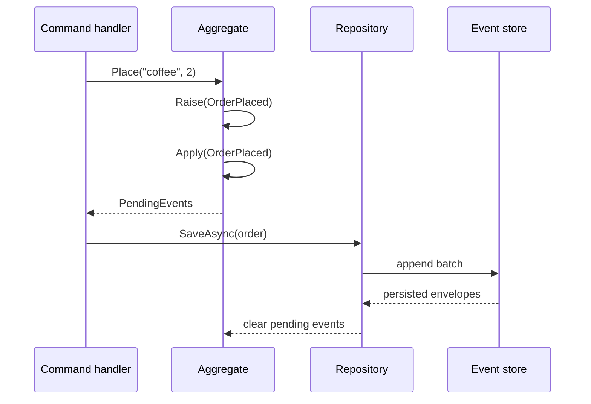

An aggregate is a small consistency boundary. Its public methods decide whether
a business action is valid; its events record that an accepted action happened.
EventLoom uses the same event application code both immediately and during
rehydration.



## An event is a persisted contract

Use an immutable type, a stable event name, a positive schema version, and an
explicit aggregate owner:

```csharp
[EventType("orders.order-placed", Version = 1)]
public sealed record OrderPlaced(string Sku, int Quantity) : IDomainEvent<Order>;
```

The CLR type name is not part of the stored identity. You may rename
`OrderPlaced` later without rewriting data when the stable event name and its
serialized shape stay compatible.

Keep stream ID, tenant ID, event ID, versions, timestamps, and technical
transport data out of the payload. Those are immutable envelope fields supplied
by EventLoom.

## An aggregate applies its own events

```csharp
public sealed class Order(Guid id) : Aggregate<Guid>(id)
{
    public string Status { get; private set; } = "draft";

    public void Place(string sku, int quantity)
    {
        if (Status != "draft" || quantity <= 0)
        {
            throw new InvalidOperationException("Only a draft order can be placed.");
        }

        Raise(new OrderPlaced(sku, quantity));
    }

    private void Apply(OrderPlaced @event) => Status = "placed";
}
```

`Raise` immediately applies the event, increments the aggregate version, and
adds it to `PendingEvents`. `ApplyHistory` replays stored events without adding
them to `PendingEvents`.

`Apply` handlers must be instance methods that are private or protected, take
exactly one event parameter, and return `void`. EventLoom validates this shape
and validates that an aggregate raises only events it owns.

## Persist aggregates through a configured repository

Configure the aggregate's durable identity once:

```csharp
eventLoom.AddAggregate<Order, Guid>(aggregate => aggregate
    .ConstructWith(id => new Order(id))
    .UseStream("order", id => id.ToString("D")));
```

Both the aggregate type string and stream-ID conversion are persisted
contracts. Keep them stable after writing data. The configured repository then
loads by ID, replays the stream, derives optimistic concurrency expectations,
and saves the events raised by normal domain methods.

Use `EventStore` directly only when background, import, repair, or integration
code must provide an explicit stream identity. See [Append and read
events](/v0.1/guides/append-and-read).
